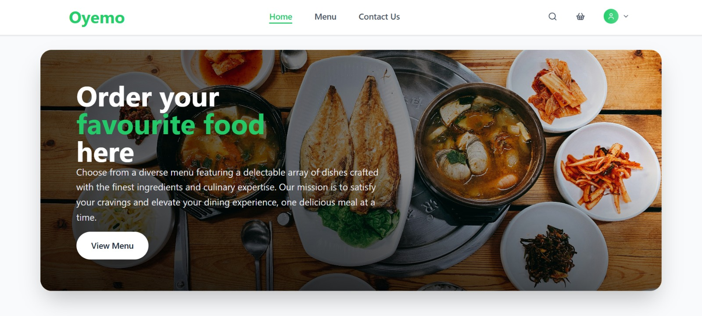
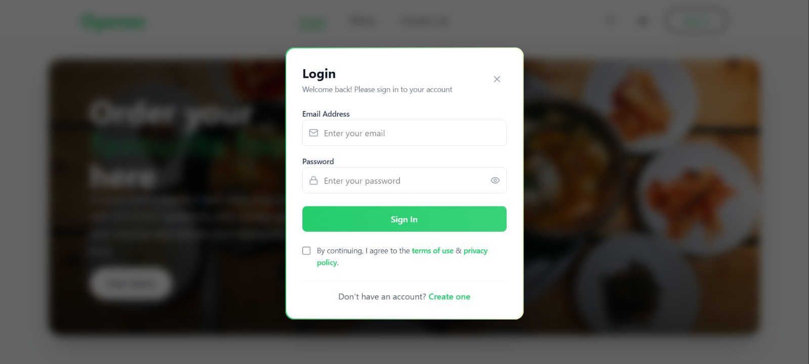
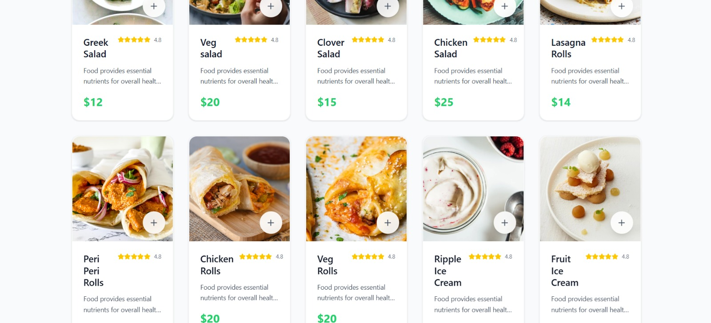
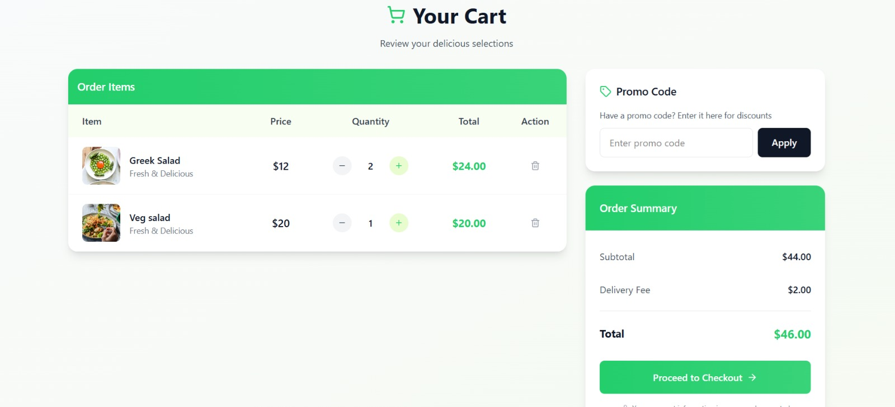
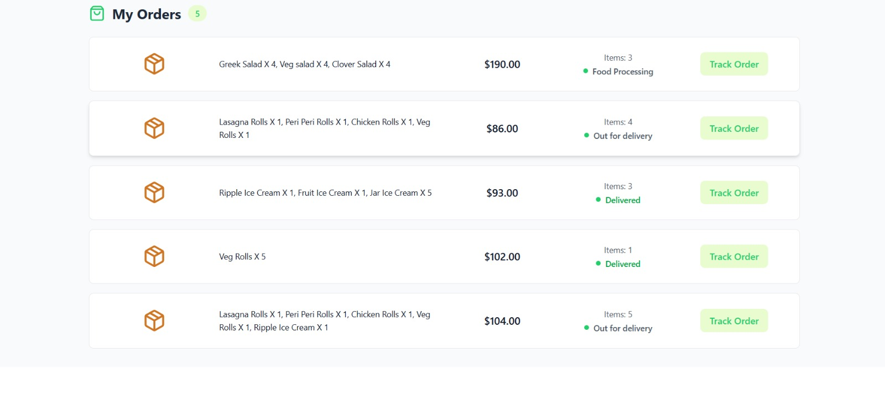
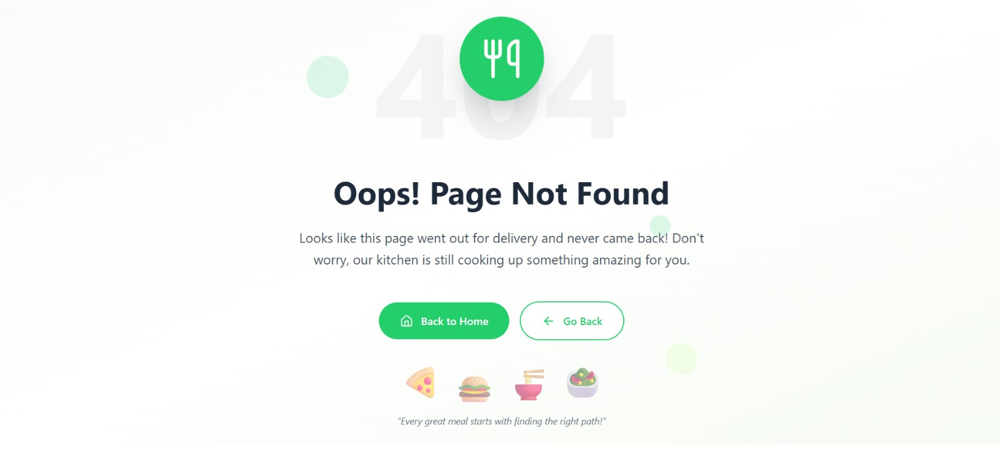
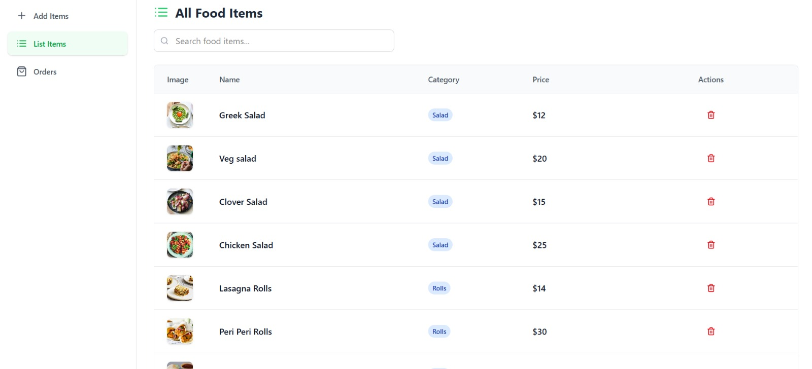

# Oyemo - A Food Delivery Solution

Oyemo is a complete food delivery solution with features for users, admin management, and secure payment integration. The app provides a smooth experience for ordering food, managing a cart, and handling payments, along with an admin panel for managing food items and orders.

---

## Website URLS

- Oyemo - A Food Delivery App -> https://oyemo.netlify.app
- Oyemo - An Admin Site -> https://oyemo-admin.netlify.app

## 📸 Screenshots

### 🔹 HomePage



### 🔹 Login



### 🔹 Menu Section



### 🔹 Cart Section



### 🔹 Order History Section



### 🔹 Not Found Page



### 🔹 Admin Panel Setup



## Tech Stack

- **Frontend:** React, Vite, Tailwind CSS
- **Backend:** Node.js, Express, MongoDB, JWT Authentication, Stripe Payment Gateway, Cloudinary for image storage
- **Admin Panel:** React, Vite, Tailwind CSS, JWT Authentication

---

## Features

**User (Customer) Features:**

- User signup and login with JWT authentication.
- Browse available food items with details.
- Add food items to cart and manage quantities.
- Proceed to checkout and pay using Stripe payment gateway.
- View order history and order details.

**Admin Panel Features:**

- Secure login for admin users.
- Add new food items with image upload to Cloudinary.
- View, update, and delete existing food items.
- View orders and order details.
- Manage order statuses.

---

## Getting Started

Follow these steps to set up the project locally.

### 1. Clone the repository

```bash
git clone https://github.com/binayak597/Oyemo.git
```

### 2. Navigate to project directories

- Frontend

```bash
cd Oyemo/frontend
```

- Backend:

```bash
cd Oyemo/backend
```

- Admin Panel:

```bash
cd Oyemo/admin
```

### 3. Environment Variables

- Create .env files in each project folder by refering .env.example file

### 4. Running the App

- Backend

```bash
npm install
npm run server
```

- Frontend

```bash
npm install
npm run dev
```

-Admin Panel

```bash
npm install
npm run dev
```

### 5. Contribution

- Contributions are welcome! If you want to contribute:

- Fork the repository.

- Create a new branch (git checkout -b feature/YourFeature).

- Make your changes.

- Commit your changes (git commit -m "Add feature").

- Push to the branch (git push origin feature/YourFeature).

- Open a Pull Request.

### 6. Author

- Built by Binayak Mukherjee 🚀
